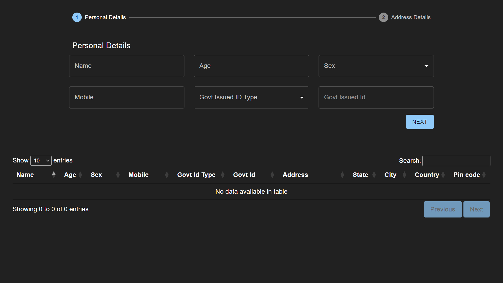

# Onito Registration App

🌐 Website : [onito-registration](https://onito-registration.vercel.app/)



<br/>

## 👨🏻‍💻 Developer's Talk
Developed by <a href="https://github.com/debrajhyper">Debraj Karmakar</a>
<span style="display:inline-flex; justify-content:space-evenly; width:20%;">
<a href="https://twitter.com/debraj_010">
  
</a>
<a href="https://www.linkedin.com/in/debrajkarmakar010/">
  
</a>
</span>

>Just wrapped up <a href="https://onito-registration.vercel.app/">Onito Registration</a>, a React& Redux project. A compact journey with big learnings. From UI design to yup integration, faced challenges that shaped my skills as a front-end dev.

<br/>

## 🚀 Tech Stack

- HTML5
- CSS3
- Typescript
- React
- Redux Toolkit
- React Redux
- Material UI
- React Hook Forms
- Hook Form Resolver
- Yup Validation
- Datatables

## 📃 APIs

[Country Name](https://restcountries.com/#endpoints-name)

<br/>

## 🏃🏻‍♂️ Run Locally

Clone the project
```
  $git clone https://github.com/debrajhyper/onito-registration.git
```

Go to the project directory
```
  cd onito-registration
```

Install dependencies
```
  $npm install
```

Start the server
```
  $npm start
```

<br/>